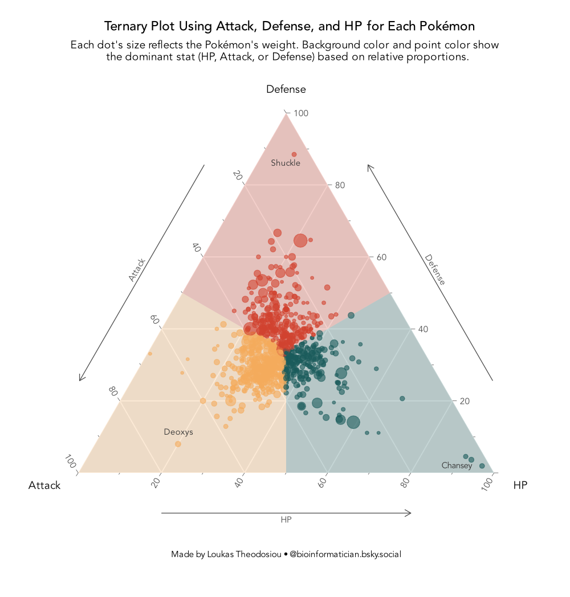
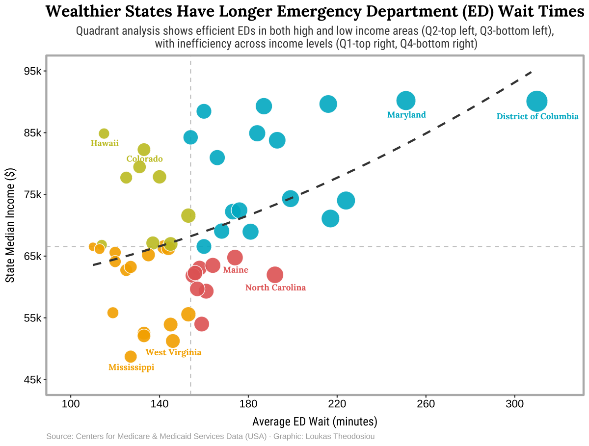

# TidyTuesday
TidyTuesday is a weekly social data project by the Data Science Learning Community, and I use it as a creative space to explore data visualization and analysis with R (and sometimes Python). This repository holds my code and visualizations from various TidyTuesday datasets.

You can follow along with my work and updates on [LinkedIn](https://www.linkedin.com/in/loukas-theodosiou-phd-a690ab91/) and [BlueSky](https://bsky.app/profile/bioinformatician.bsky.social)

## 🔍 [Explore the Pokémon Ternary Plot](2025/20250401_pokemon)

## 🔍 [Explore the Pokémon Ternary Plot](2025/20250401_pokemon)

