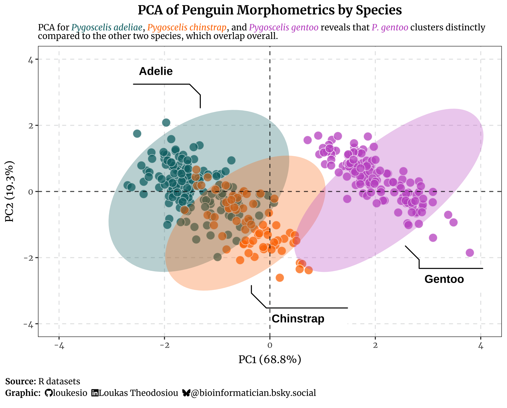
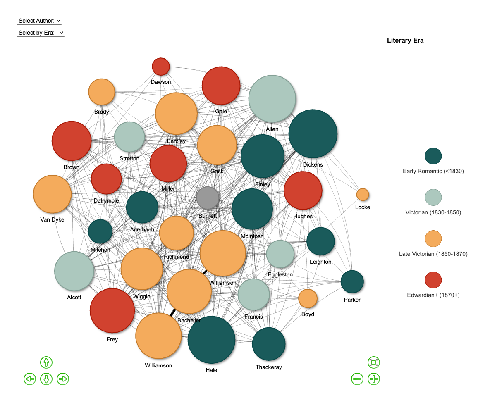

# 📊 TidyTuesday Visualizations

A curated collection of data visualizations and analyses from the [#TidyTuesday](https://github.com/rfordatascience/tidytuesday) weekly social data project.

> **TidyTuesday** is a weekly data challenge by the Data Science Learning Community. This repository showcases my explorations in data visualization using R and occasionally Python.

## 🔗 Connect

[](https://www.linkedin.com/in/loukas-theodosiou-phd-a690ab91/)
[](https://bsky.app/profile/bioinformatician.bsky.social)

---

## 2025 Visualizations

### April 2025

#### [Pokémon Type Distribution - Ternary Plot](2025/2025-04-01_Pokemon/20250401_pokemon.R)
*April 1, 2025*

<a href="2025/2025-04-01_Pokemon/20250401_pokemon.R">
  
</a>

**Visualization highlights:** Ternary plot exploring the compositional relationships between Pokémon primary types using ggtern.

---

#### [Emergency Department Wait Times vs. Income](2025/2025-04-08_TimelyEffectiveCare/medical_quadrant.R)
*April 8, 2025*

<a href="2025/2025-04-08_TimelyEffectiveCare/medical_quadrant.R">
  
</a>

**Visualization highlights:** Quadrant analysis revealing the relationship between emergency department waiting times and median household income across US states.

---

#### [Palmer Penguins - PCA Analysis](2025/2025-04-15_Penguins/PCA_penguins.R)
*April 15, 2025*

<a href="2025/2025-04-15_Penguins/PCA_penguins.R">
  
</a>

**Visualization highlights:** Principal component analysis of penguin morphological measurements, revealing species clustering patterns.

---

### November 2025

#### [Special Indicators Analysis](2025/2025-11-25_SPIndicators/README.md)
*November 25, 2025*

Exploring temporal patterns and correlations in special economic indicators. *(Add visualization once available)*

---

### December 2025

#### [Christmas Novels Network Analysis](2025/2025-12-30_XmasNovels/20251230_XmasNovels.R)
*December 30, 2025*

<a href="2025/2025-12-30_XmasNovels/20251230_XmasNovels.R">
  
</a>

**Visualization highlights:** Network visualization exploring thematic connections and relationships in Christmas literature.

---

## 🛠️ Tools & Technologies

- **R**: ggplot2, ggtern, tidyverse, igraph, network analysis packages
- **Python**: pandas, matplotlib, seaborn (occasional use)
- **Version Control**: Git & GitHub

## 📁 Repository Structure

```
tidytuesday/
├── 2025/
│   ├── 2025-04-01_Pokemon/
│   │   ├── 20250401_pokemon.R
│   │   ├── ggtern_pokemon.pdf
│   │   └── ggtern_pokemon.png
│   ├── 2025-04-08_TimelyEffectiveCare/
│   │   ├── medical_quadrant.R
│   │   ├── Timely_and_Effective_Care-State.csv
│   │   └── ED_waits_by_income_nice_size.png
│   ├── 2025-04-15_Penguins/
│   │   ├── PCA_penguins.R
│   │   └── penguins_pca.png
│   ├── 2025-11-25_SPIndicators/
│   └── 2025-12-30_XmasNovels/
│       ├── 20251230_XmasNovels.R
│       ├── network.html
│       └── network_snapshot.png
└── README.md
```

---

## 💡 About TidyTuesday

TidyTuesday is organized by the [R4DS Online Learning Community](https://www.rfordatasci.com/). Each week, a new dataset is released for the community to explore and visualize. It's a fantastic opportunity to practice data wrangling, visualization, and storytelling with data.

Learn more: [TidyTuesday GitHub Repository](https://github.com/rfordatascience/tidytuesday)

---

## 📝 License

This work is shared under the MIT License. Feel free to use the code and adapt it for your own learning and projects.

---

*Last updated: January 2026*
